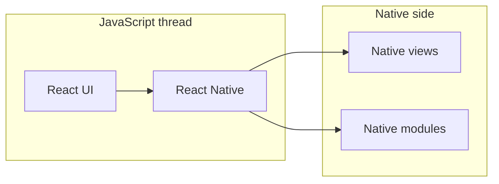

# Building a Mobile App with React Native & Expo (Live)

**Central PA Open Source Conference** · ~30 minutes of content · 45-minute slot (intros + buffer + Q&A)

**Stack:** Expo SDK **54**, **pnpm**, Expo Router (app + optional API routes), focus on **native app** (Expo Web as optional 2-minute teaser).

---

## Learning outcomes

By the end, attendees can:

- Bootstrap a React Native app with Expo and run it on a device or simulator.
- Explain why UI updates feel “instant” (Fast Refresh / Metro).
- Add maps, geolocation, and a quick sensor readout.
- Describe the bridge / native module idea at a high level.
- Sketch how a tiny full-stack loop works in Expo (client ↔ API route ↔ simple persistence).

---

## Room setup (before doors open)

- Phone on same network **or** use **tunnel** for Expo Go / dev build.
- Simulator/emulator ready as backup if Wi‑Fi is flaky.
- Terminal font size readable from the back row; hide secrets; use a **demo-only** Expo account if needed.
- Second display: slides or this doc on one screen, IDE + terminal on the other.

---

## Time budget (30 minutes of you talking + demo)

| Block | Minutes | What |
|------|--------:|------|
| Hook + goals + agenda | 2 | Why RN/Expo, what we’ll build |
| Create project + run (Hello World) | 5 | `pnpm create`, run, edit text |
| Fast Refresh + small UI change | 3 | Prove near-instant updates |
| Maps + geolocation | 6 | Map, permission, user dot |
| Sensor teaser | 3 | Accelerometer or gyro snippet |
| Architecture (bridge, native modules) | 4 | Diagram + mental model |
| Interactive: map + text via API route | 5 | POST/GET, file or JSON store |
| Optional: Expo Web | 2 | Same routes, web preview |
| Close + Q&A handoff | — | Rest of slot |

If you run long, **cut** optional Expo Web first, then trim sensor to one sentence + single reading.

---

## What you’re building (one coherent story)

A small **“CPOSC live board”** app:

1. **Hello World** → rename title, tweak styles (Fast Refresh).
2. **Map** centered on the conference (or “here”) with **expo-location**.
3. **Live pins / messages:** attendees (or you + volunteers) **POST** latitude/longitude + short text to an **Expo Router API route**; everyone **polls** or pulls on refresh and sees markers or a list.

State on disk: e.g. `data/board.json` (gitignored) — trivial to explain, no database.

---

## Slides / sections (speaker outline)

### 1. Title

- **Building a mobile app with React Native — live, with checkpoints**
- Your name, role, one-line credibility (optional).

### 2. Why React Native + Expo here

- **RN:** one codebase, native UI components, huge ecosystem.
- **Expo:** sane defaults, SDK-aligned native modules, **Expo Go** or dev builds for fast iteration.
- **Today:** app-first; we might peek at **Expo Web** if time.

### 3. Agenda (matches the synopsis)

- Setup → Hello World → fast updates → maps + location → sensor taste → **how RN works** → tiny server (API routes) → Q&A.

### 4. Live demo — project creation

- **pnpm** + **Expo SDK 54** (pin versions in `package.json` / `app.json` before the talk).
- Show the **Metro** terminal, QR code or simulator, and the default screen.

### 5. Hello World + Fast Refresh

- Change a string / style; save → **near-instant** update without losing navigation state (when possible).
- One sentence: **Metro** bundles JS; **Fast Refresh** patches the running app.

### 6. Maps + geolocation

- Install maps + location packages with **`expo install`** (keeps native versions aligned with SDK 54).
- **Permissions:** explain iOS/Android prompts; fail gracefully in simulator (e.g. fixed lat/long fallback for demo).

### 7. Sensor teaser

- **`expo-sensors`:** show `Accelerometer` or `Gyroscope` subscription, **unsubscribe** in `useEffect` cleanup (good practice in 10 seconds).

### 8. Architecture — how React Native “works”

Use a simple diagram (whiteboard or slide):



**Talk track:**

- **JS thread:** your React code, Metro bundle.
- **Native side:** real `UIView` / Android views, **native modules** (location, sensors, maps) exposed to JS.
- **Bridge / JSI (high level):** serialized calls or faster modern paths; attendees don’t need JNI details—just “JS asks native to do work and comes back with a result.”

### 9. Full-stack in one repo (optional but fits CPOSC)

- **Expo Router API routes** (`+api.ts`): same **dev server** as the app in development.
- **Tunnel:** `expo start --tunnel` can expose the dev server so phones not on your LAN still load the bundle; **relative `fetch('/api/...')`** targets that same origin in dev (see [API Routes](https://docs.expo.dev/router/reference/api-routes)).
- **If** something in your environment ever split API traffic to another port, run a **second** tunnel for that port—your `setup-connections.sh` already shows the pattern for forwarding **8081**; duplicate the idea for another port only if needed.

### 10. Interactive segment (keep it boring on purpose)

- **POST** `{ message, lat, lng }` → append to JSON file (cap length, max entries to avoid disk abuse during Q&A).
- **GET** returns recent entries; map **markers** + optional **FlatList**.
- **Facilitation:** “Paste a short shout-out; I’ll add the first five from the room” — avoids needing everyone’s device online.

### 11. Optional: Expo Web (≤2 min)

- `expo start --web` or press `w` — same project; note layout differences; not the hero of the talk.

### 12. Close

- Recap: setup → refresh → native modules → tiny API.
- Point to **docs.expo.dev**, **React Native** docs, and this repo if you publish slides.

---

## Live demo — commands cheat sheet (pnpm + SDK 54)

Adjust app name as you like; pin `expo` to 54 in the template or immediately after create.

```bash
# New app (tabs template is nice for Router + multiple screens)
pnpm create expo-app@latest cposc-live --template tabs

cd cposc-live
pnpm install

# Align native libs with SDK (examples — run expo install for each)
pnpm exec expo install expo-location expo-sensors react-native-maps

pnpm exec expo start --tunnel
# then: scan QR (Expo Go / dev build), or i for iOS / a for Android
```

**API routes (Expo Router):** follow current docs for SDK 54 — enable whatever `app.json` / `expo-router` config the docs require for server routes (e.g. `web.output` / `origin` for production; dev often “just works” with relative fetch).

---

## Git checkpoints (“if this goes sideways”)

Prefer **tags or branches** over a pile of stashes: you can `git reset --hard` in one second on stage.

### Option A — branches (recommended)

Create ahead of time; during the talk, `git checkout demo/03-map` etc. if you need a clean tree.

| Branch | Contains |
|--------|----------|
| `demo/00-blank` | Fresh create (optional) |
| `demo/01-hello` | Hello World + copy tweak |
| `demo/02-refresh` | Styled component proving Fast Refresh |
| `demo/03-map` | Map + geolocation + permission handling |
| `demo/04-sensors` | Sensor hook |
| `demo/05-api` | API route + file persistence + map markers |

Commands:

```bash
git checkout demo/03-map   # nuclear option: known-good map step
git stash push -m "wip mid-sentence"   # if you only need to shelve WIP
```

### Option B — annotated tags

```bash
git tag -a cposc-03-map -m "Map + location working"
# Bailout:
git reset --hard cposc-03-map
```

### Option C — stashes only

Name messages so you can find them:

```bash
git stash push -m "cposc: after hello world"
git stash list
git stash apply stash^{/cposc: after hello world}
```

**House rule on stage:** never improvise dependency major bumps; **restore checkpoint** and continue.

---

## Risk register (short)

| Risk | Mitigation |
|------|------------|
| Conference Wi‑Fi blocks tunnel | USB / simulator; or pre-recorded 60s clip of Fast Refresh |
| Maps key / provider issues | Fallback: static region + one hardcoded marker + list UI |
| Location denied | Simulator default coordinates + explain permissions |
| API route / CORS / origin | Use relative URLs in dev; match Expo SDK 54 docs for `origin` in prod |

---

## Q&A prompts (if the room is quiet)

- When would you **eject** or use a **custom dev client**?
- How does this differ from **Flutter** / **Capacitor**?
- How do you **ship** to stores (EAS Build, versioning, review)?

---

## References

- [Expo Documentation](https://docs.expo.dev/)
- [Expo Router API Routes](https://docs.expo.dev/router/reference/api-routes)
- [React Native Architecture](https://reactnative.dev/docs/getting-started) (overview + community resources)

---

## Your tunnel script (existing repo)

`setup-connections.sh` forwards **8081** (Metro) to your VPS. If you ever run a **second** dev port for APIs, mirror that pattern with another `-R hostport:127.0.0.1:localport` line. In the common case with Expo SDK 54 + Router API routes, **one tunnel / one `expo start --tunnel`** is enough.
